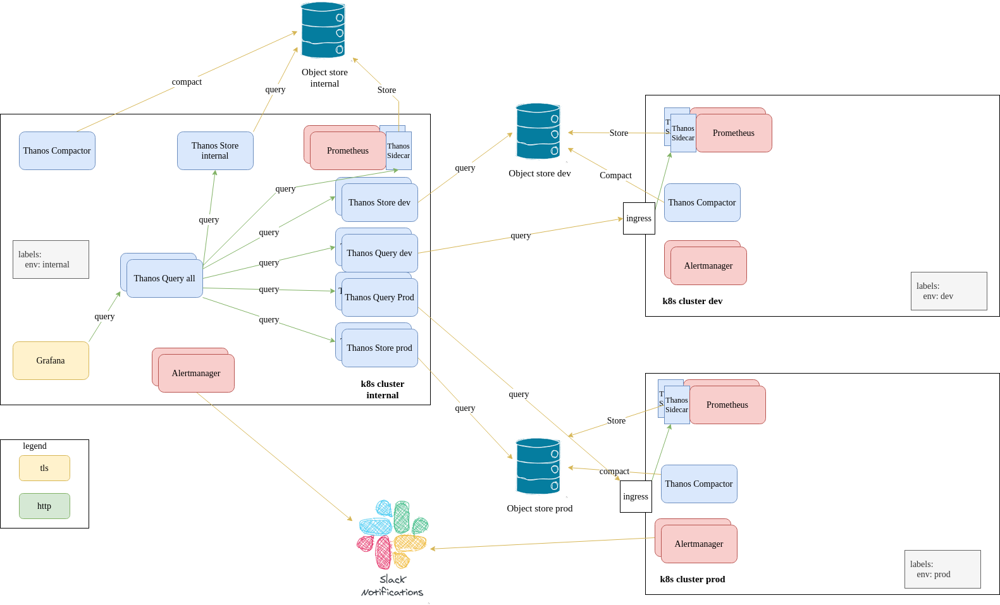

# Monitoring

Monitoring is crucial component of any infrastructure. Monitoring answers this basic questions
* What is the current state of our system
* In what state our system was at a certain time or a certain period of time
  
Having such information engineers can tell

* is there an issue with the application
* What has caused the issue
* How changes in a specific component affect the application and in what way
* How much load (users, requests, messages etc) can the application currently handle
* How much resources do we need to handle `n` amount of users, requests, messages etc
* What needs to be imporved in the application to improve its performance

Monitoring consists of several components
* metrics
* metric aggregation system
* visualization

# Alerting

Alerting is a way to notify interested parties if an important event happened in the system.
Each event has a severity and a set of actions that need to be taken

# Architecture proposal

## Explanation

This architecture is based on Prometheus as a common monitoring system for monitoring kubernetes clusters

Prometheus components:
* Prometheus server. Used for
    * API for issueing queries (promql)
    * Pulling metrics from metric exporters
    * service discovery (to discover metric exporters)
    * tsdb (time series database for storing metrics and labels)
* alertmanager (for managing alerts - routing, grouping, inhibition, silencing)
* Grafana - metric visualization  (dashboards)

As any system prometheus has its pros and cons

Pros:
* simple data model with time series data identified by metric name and key/value pairs
* PromQL, a flexible query language to leverage this data model
* time series collection happens via a pull model over HTTP
    * exporters output metrics in very simple format
* targets are discovered via service discovery
* huge community and SDKs for most of popular languages
  
Cons:
* scales only vertically
* doesnt have long term storage support
* no HA

There are couple of options to mitigate the `scaling` con. One of the most used ones is to separate prometheuses by metric types eg api gateway metrics are scraped by `prometheus-api-gw`, service mesh metrics are scraped by `promtheus-service-mesh` etc. With this approach you visualization configuration gets more sophisticated - you will need to maintain either multiple grafanas or multiple datasources (this way you cant make calculations based on multiple datasources)

There is no cheap way to overcome the `long term storage` con using classic prometheus setup. You either decrease the metric retention or increase the storage increasing metric cost

To solve issues that prometheus has we chose `Thanos` as easy to use, cheap and scalable solution (although there are also other solutions like cortex, victoria metrics etc)

## Thanos
Using `Thanos` we can 
* create single `promql` endpoint from which we can query any metric in any cluster we have
* use unlimited/cheap storage (object store) for metrics

### Components

#### Thanos sidecar
[Thanos sidecar](https://thanos.io/tip/components/sidecar.md/) is a sidecar container running along with main prometheus that
* sends tsdb samples to long term storage (s3, gcs etc)
* implements Thanos’ Store API on top of Prometheus’ remote-read API.

#### Thanos compactor
[Compactor](https://thanos.io/tip/components/compact.md/) is a thanos service that compacts and downsamples tsdb samples in object storage

#### Thanos store
[Store](https://thanos.io/tip/components/store.md/) is a thanos component that implements the Store API on top of historical data in an object storage bucket

#### Thanos query
Implements the Prometheus HTTP v1 API to query data in a Thanos cluster via PromQL.[ Thanos query](https://thanos.io/tip/components/query.md/) essentially allows to aggregate and optionally deduplicate multiple metrics backends under single Prometheus Query endpoint. Can query data from
* Prometheus (see Sidecar)
* Object Storage (see Store )
* Another Querier (you can stack Queriers on top of each other)

